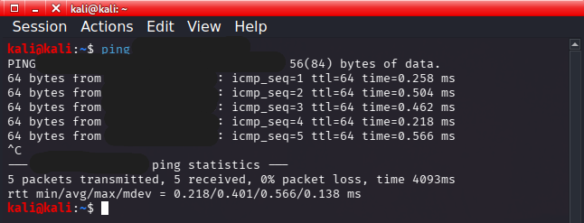

# Virtual Cybersecurity Lab Setup

## Status
Completed - Initial Lab Setup

## Project Overview
This project documents the setup of a VMware-based virtual cybersecurity lab environment for hands-on security practice. The lab is designed to provide a safe, isolated environment for learning networking, vulnerability scanning, system administration, and basic security testing.

The initial build focuses on creating the lab foundation with virtual machines, documented network design, screenshots, and planned expansion into scanning, vulnerability assessment, monitoring, and segmented lab networks.

## Lab Network Diagram

The network diagram shows the planned layout for the virtual cybersecurity lab, including the host system, virtual machines, and isolated lab network.

## Project Goals
- Set up a safe virtual lab environment
- Configure virtual machines for cybersecurity practice
- Practice networking between lab systems
- Use Kali Linux for security tools
- Use Windows and Linux systems as lab machines
- Use vulnerable targets for legal security testing
- Document the lab layout, setup process, and lessons learned

## Tools Used

- Windows host system
- VMware Workstation Pro
- Kali Linux
- Metasploitable 2

## Future Tools

- Nmap
- Nessus Essentials
- Windows Server/Active Directory lab environment
- SIEM monitoring tools

## Deliverables
- Lab network diagram
- VMware Workstation installation documentation
- Kali Linux virtual machine
- Metasploitable 2 vulnerable target machine
- Virtual network configuration
- Connectivity testing screenshot
- Lessons learned documentation

## Lab Build Checklist

- [x] Created lab network diagram
- [x] Installed VMware Workstation
- [x] Created Kali Linux virtual machine
- [x] Added vulnerable target machine
- [x] Configured virtual networking
- [x] Verifed connectivity between lab machines

### VMware Workstation Installed

VMware Workstation was installed as the virtualization platform used to run and manage the lab virtual machines.

## Kali Linux VM Running

Kali Linux was added to VMware Workstation as the primary security testing machine for this virtual cybersecurity lab.

## Metasploitable 2 VM Running

Metasploitable 2 was added as the intentionally vulnerable target machine for legal scanning and security testing inside the isolated virtual lab environment.

## Connectivity Verification

Basic network connectivity was tested between the Kali Linux VM and the Metasploitable 2 VM. The successful ping test confirmed both virtual machines were connected to the same lab network and are ready for future scanning practice.

## Lessons Learned

During this project, I learned how to build a basic virtual cybersecurity lab using VMware Workstation Pro. I practiced creating and organizing virtual machines, documenting a lab network diagram, and preparing an isolated enviornment for security testing. 

I also learned the importance of keeping cybersecurity labs seperate from personal or production systems because the lab uses an intentionally vulnerable target machine. By isolating Kali Linux and Metasploitable 2 in a controlled environment, I was able to practice connectivity testing without compromising my personal computer or other devices on my network.

## Notes
This project documents the initial setup of a virtual cybersecurity lab. Future updates will build on this environment with Nmap scanning, Nessus vulnerability assessment, Active Directory practice, and security monitoring.
