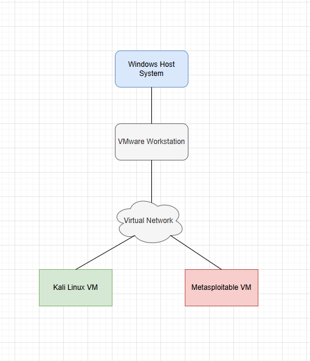
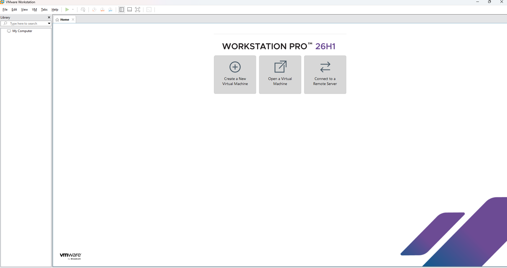
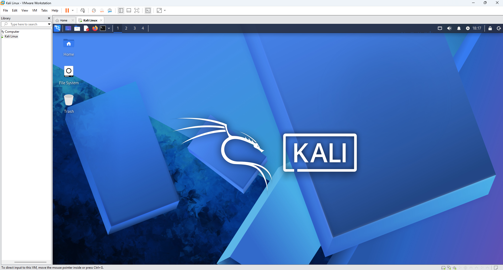
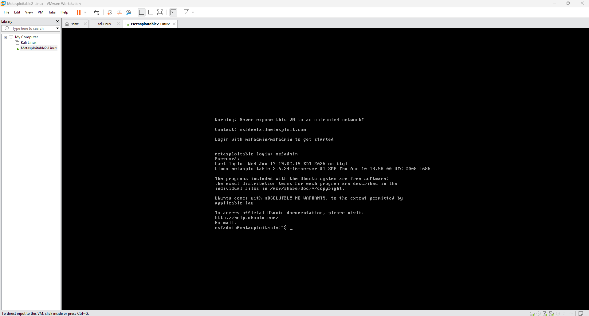

# Virtual Cybersecurity Lab Setup

## Status
In Progress

## Project Overview
This project documents the setup of a VMware-based virtual cybersecurity lab environment for hands-on security practice. The lab is designed to provide a safe, isolated environment for learning networking, vulnerability scanning, system administration, and basic security testing.

The initial build focuses on creating the lab foundation with virtual machines, documented network design, screenshots, and planned expansion into scanning, vulnerability assessment, monitoring, and segmented lab networks.

## Lab Network Diagram

The network diagram shows the planned layout for the virtual cybersecurity lab, including the host system, virtual machines, and isolated lab network.

## Project Goals
- Set up a safe virtual lab environment
- Configure virtual machines for cybersecurity practice
- Practice networking between lab systems
- Use Kali Linux for security tools
- Use Windows and Linux systems as lab machines
- Use vulnerable targets for legal security testing
- Document the lab layout, setup process, and lessons learned

## Tools Planned
- VMware Workstation
- Kali Linux
- Windows host system
- Metasploitable
- Nmap
- Nessus Essentials

## Deliverables
- Lab network diagram
- VMware Workstation installation documentation
- Planned Kali Linux virtual machine
- Planned target virtual machine
- Planned virtual network configuration
- Planned IP addressing plan
- Planned connectivity testing
- Lessons learned documentation

## Lab Build Checklist

- [x] Use Windows host system for lab management
- [x] Create lab network diagram
- [x] Install VMware Workstation
- [x] Create Kali Linux virtual machine
- [x] Add vulnerable target machine
- [ ] Configure virtual networking
- [ ] Verify connectivity between lab machines
- [ ] Take setup screenshots
- [ ] Document lessons learned

### VMware Workstation Installed

VMware Workstation was installed as the virtualization platform used to run and manage the lab virtual machines.

## Kali Linux VM Running

Kali Linux was added to VMware Workstation as the primary security testing machine for this virtual cybersecurity lab.

## Metasploitable 2 VM Running

Metasploitable 2 was added as the intentionally vulnerable target machine for legal scanning and security testing inside the isolated virtual lab environment.

## Notes
This project is currently in progress and will be updated as the virtual lab environment is built and documented.
